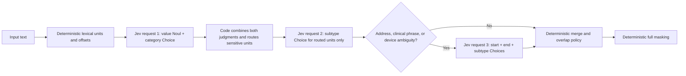

# PRISM: Economy vs. Latency Profile

## CTO decision brief

**Document status:** Development benchmark and architecture decision record  
**Evaluation date:** 2026-09-19  
**Model:** `jev-1.13.0`  
**PRISM taxonomy:** `1.0.0`  
**Recommendation:** Use the **Economy profile** as the default production candidate and validate it in shadow mode on a traffic-derived holdout set before enforcing masking.

---

## 1. Executive decision

The Economy profile is the stronger default on the current benchmark:

- **100.0% strict span F1** versus **90.6%** for Latency.
- **50/50 exact masks** versus **46/50**.
- **57.5% fewer billed input tokens** and therefore **57.5% lower estimated inference cost**.
- A **223 ms median-latency penalty**, but a **740 ms better p95** in this run.
- All credential and financial spans were exact in both profiles; the Latency profile lost accuracy on multi-token addresses, clinical phrases, and IMEI/device-ID disambiguation.

The one-call Latency profile did not produce a compelling latency/cost trade-off. It reduced calls from 2.14 to 1.00 per case, but it sent every possible subtype branch speculatively. That raised input tokens by 2.35×, cost by 2.35×, and introduced seven strict false positives plus four strict false negatives.

### Decision scorecard

| Decision dimension | Economy | Latency | Winner |
| --- | ---: | ---: | --- |
| Strict precision | 100.0% | 88.3% | Economy |
| Strict recall | 100.0% | 93.0% | Economy |
| Strict F1 | 100.0% | 90.6% | Economy |
| Exact masking | 50/50 | 46/50 | Economy |
| Estimated cost per benchmark case | $0.000478 | $0.001124 | Economy |
| Input tokens per case | 11,381 | 26,750 | Economy |
| API calls per case | 2.14 | 1.00 | Latency |
| Mean latency | 1,223 ms | 1,082 ms | Latency by 141 ms |
| p50 latency | 999 ms | 776 ms | Latency by 223 ms |
| p95 latency | 2,642 ms | 3,382 ms | Economy by 740 ms |
| p99 latency | 4,593 ms | 4,199 ms | Latency by 394 ms |
| Multi-token boundary quality | Exact on this set | Four failed cases | Economy |
| Recommended use | Default/shadow candidate | Experimental comparison | Economy |

---

## 2. Headline charts

The bars below use the recorded live evaluation results, not modeled values.

### 2.1 Strict span quality

```text
Precision
Economy  ████████████████████  100.0%
Latency  ██████████████████░░   88.3%

Recall
Economy  ████████████████████  100.0%
Latency  ███████████████████░   93.0%

F1
Economy  ████████████████████  100.0%
Latency  ██████████████████░░   90.6%

Exact-mask case rate
Economy  ████████████████████  100.0%  (50/50)
Latency  ██████████████████░░   92.0%  (46/50)
```

### 2.2 Strict span confusion counts

```text
                         Economy     Latency
True positives              57          53
False positives              0           7
False negatives              0           4
```

Under relaxed overlap matching, Latency improved to 55 TP, 5 FP, and 2 FN. This shows that two of its failures detected the right semantic area but split the expected multi-token span incorrectly. Relaxed overlap is useful diagnostically, but deterministic masking requires exact boundaries, so strict metrics remain the decision metric.

### 2.3 Billed input tokens and estimated cost

```text
Input tokens, lower is better
Economy  █████████░░░░░░░░░░░    569,057  (42.5% of Latency)
Latency  ████████████████████  1,337,521  (100.0%)

Estimated cost, lower is better
Economy  █████████░░░░░░░░░░░  $0.023900  (50-case run)
Latency  ████████████████████  $0.056176  (50-case run)
```

Economy used **768,464 fewer input tokens** on the same 50 cases. The evaluation harness calculates cost as billed input tokens × **$0.042 per million input tokens**. This estimate excludes future price changes, taxes, network costs, observability, and internal service overhead.

### 2.4 Latency distribution

```text
Milliseconds, lower is better

                 p50                  p95                  p99
Economy          999                 2,642                4,593
Latency          776                 3,382                4,199

Economy  p50  ██████████            999 ms
Latency  p50  ████████              776 ms

Economy  p95  █████████████         2,642 ms
Latency  p95  █████████████████     3,382 ms

Economy  p99  ███████████████████   4,593 ms
Latency  p99  █████████████████     4,199 ms
```

The single-call profile won at the median but not at p95. This small run is not sufficient for an SLO commitment; regional and sustained-load tests are still required.

### 2.5 API-call and question-volume trade-off

```text
API calls, 50 cases
Economy  ████████████████████  107  (2.14/case)
Latency  █████████░░░░░░░░░░░   50  (1.00/case)

Output tokens returned
Economy  ████░░░░░░░░░░░░░░░░   44,187
Latency  ████████████████████  215,010
```

Latency saved 57 network calls but produced 4.87× as many output tokens and 2.35× as many input tokens because it asked all category-specific subtype branches for every lexical unit.

---

## 3. How the two profiles work

### 3.1 Economy profile



Properties:

- Pays the subtype cost only for routed sensitive units.
- Uses two independent Jev judgments—value membership and category—to reduce single-question false negatives.
- Adds a targeted refinement request only where development errors showed boundary or subtype ambiguity.
- Allows code to keep exact offsets and masking deterministic.
- Usually needs two serial API calls; selected phrases need a third.

### 3.2 Latency profile


Properties:

- Always uses one API call per window.
- Speculatively asks subtype questions for all five top-level categories, even though only one branch can be used.
- Avoids a serial round trip but has a much larger prompt and response.
- Does not run the targeted boundary/subtype refinement stage.
- Failed on the error classes the targeted Economy refinement was designed to address.

### 3.3 Why Economy can be both more accurate and cheaper

The name “Economy” refers to conditional computation, not weaker reasoning. It asks a smaller sequence of relevant questions:

1. Is this exact unit part of a sensitive value?
2. Which top-level category fits it?
3. Only if routed: which subtype fits it?
4. Only if the subtype is known to be boundary-sensitive: where exactly does the span start and end, and should the subtype be corrected?

Latency flattens this dependency tree into one large speculative request. It saves one network round trip but spends model context on branches that code later discards.

---

## 4. Evaluation methodology

### 4.1 Dataset composition

| Property | Value |
| --- | ---: |
| Cases | 50 |
| Gold sensitive spans | 57 |
| Taxonomy subtypes covered | 40/40 |
| Total input characters | 3,040 |
| Mean characters per case | 60.8 |
| Minimum / maximum characters | 34 / 103 |
| Total lexical units | 398 |
| Mean lexical units per case | 7.96 |
| Minimum / maximum lexical units | 5 / 14 |
| Clean negative cases | 2 |
| Multi-span cases | 6 |
| Prompt-injection cases | 1 |

The corpus includes:

- every PRISM subtype;
- identity, credential, financial, health, and digital data;
- mixed-category sentences;
- multi-token names, addresses, diagnoses, procedures, and history;
- field-name-only and capitalized-word negatives;
- repeated values;
- a multilingual identity case;
- credential-bearing connection strings and sensitive URLs;
- an embedded instruction telling the classifier to return `NONE`.

### 4.2 Metric definitions

- **Strict true positive:** predicted start offset, end offset, and subtype all exactly match a gold span.
- **Relaxed true positive:** subtype matches and predicted/gold spans overlap.
- **Exact mask:** the complete masked output string matches the expected output.
- **Precision:** TP ÷ (TP + FP).
- **Recall:** TP ÷ (TP + FN).
- **F1:** harmonic mean of precision and recall.
- **Latency:** end-to-end detector time recorded for each case, including serial Jev calls.
- **Estimated cost:** billed input tokens × $0.042/1M input tokens.

### 4.3 Execution conditions

- Both profiles used the same dataset, taxonomy, Jev model, scoring code, and concurrency of four evaluation jobs.
- Economy made 107 API calls; Latency made 50.
- Both runs completed with zero API errors.
- Economy wall time for the concurrent 50-case run was 15.607 seconds.
- Latency wall time was 13.958 seconds.
- Wall time is not a throughput benchmark because jobs were concurrent and external API conditions were uncontrolled.

### 4.4 Important statistical limitation

This is a **small, hand-authored development benchmark**, not an independent production holdout. Several prompt and taxonomy improvements were informed by failures observed on this corpus. Therefore:

- 100% Economy performance must not be presented as expected production accuracy.
- Most subtypes have only one or two gold examples.
- The corpus contains short inputs and does not represent production document-length distribution.
- The two profile results are single full-suite runs; only the Economy prompt-injection case received a 10-run consistency check.
- Confidence calibration, country-specific coverage, obfuscation, OCR noise, sustained load, and regional variance remain unproven.

The result supports an architecture decision and a shadow deployment—not an accuracy SLA.

---

## 5. Aggregate results

### 5.1 Accuracy and reliability

| Metric | Economy | Latency | Economy delta |
| --- | ---: | ---: | ---: |
| Strict TP | 57 | 53 | +4 |
| Strict FP | 0 | 7 | -7 errors |
| Strict FN | 0 | 4 | -4 errors |
| Strict precision | 100.0% | 88.3% | +11.7 pp |
| Strict recall | 100.0% | 93.0% | +7.0 pp |
| Strict F1 | 100.0% | 90.6% | +9.4 pp |
| Relaxed precision | 100.0% | 91.7% | +8.3 pp |
| Relaxed recall | 100.0% | 96.5% | +3.5 pp |
| Relaxed F1 | 100.0% | 94.0% | +6.0 pp |
| Exact cases | 50/50 | 46/50 | +4 cases |
| Exact mask rate | 100.0% | 92.0% | +8.0 pp |
| API errors | 0 | 0 | Equal |

### 5.2 Latency

| Metric | Economy | Latency | Economy relative to Latency |
| --- | ---: | ---: | ---: |
| Mean | 1,223 ms | 1,082 ms | +141 ms / +13.0% |
| p50 | 999 ms | 776 ms | +223 ms / +28.7% |
| p95 | 2,642 ms | 3,382 ms | -740 ms / -21.9% |
| p99 | 4,593 ms | 4,199 ms | +394 ms / +9.4% |

Interpretation: fewer calls improved Latency's median, but prompt size and API variability prevented a consistent tail advantage. A larger controlled load test is needed before treating these percentiles as stable.

### 5.3 Token use and cost

| Metric | Economy | Latency | Economy delta |
| --- | ---: | ---: | ---: |
| Input tokens | 569,057 | 1,337,521 | -768,464 / -57.5% |
| Input tokens per case | 11,381 | 26,750 | -15,369 |
| Output tokens | 44,187 | 215,010 | -170,823 / -79.4% |
| Output tokens per case | 884 | 4,300 | -3,416 |
| API calls | 107 | 50 | +57 |
| API calls per case | 2.14 | 1.00 | +1.14 |
| Estimated 50-case cost | $0.023900 | $0.056176 | -$0.032275 |
| Estimated cost per case | $0.000478 | $0.001124 | -$0.000646 |

---

## 6. Results by top-level category

These are strict exact-span and subtype metrics aggregated from the detailed predictions.

| Category | Gold spans | Economy TP/FP/FN | Economy F1 | Latency TP/FP/FN | Latency P/R/F1 |
| --- | ---: | ---: | ---: | ---: | --- |
| IDENTITY | 16 | 16 / 0 / 0 | 100.0% | 15 / 2 / 1 | 88.2% / 93.8% / 90.9% |
| CREDENTIAL | 12 | 12 / 0 / 0 | 100.0% | 12 / 0 / 0 | 100.0% / 100.0% / 100.0% |
| FINANCIAL | 9 | 9 / 0 / 0 | 100.0% | 9 / 0 / 0 | 100.0% / 100.0% / 100.0% |
| HEALTH | 10 | 10 / 0 / 0 | 100.0% | 8 / 4 / 2 | 66.7% / 80.0% / 72.7% |
| DIGITAL | 10 | 10 / 0 / 0 | 100.0% | 9 / 1 / 1 | 90.0% / 90.0% / 90.0% |

The Latency risk is concentrated rather than uniform. Credentials and financial values were exact on this dataset; multi-token health spans were the weakest category.

---

## 7. Latency-profile failure analysis

| Case | Expected | Latency output | Strict impact | Economy mechanism that corrected it |
| --- | --- | --- | --- | --- |
| Address | `42 Lake View Road, Pune` → `ADDRESS` | Two fragments: `42` and `Road, Pune` | 0 TP, 2 FP, 1 FN | Explicit start/end boundary Choices selected the complete address |
| Procedure | `coronary artery bypass surgery` → `PROCEDURE` | Two fragments: `coronary` and `bypass surgery` | 0 TP, 2 FP, 1 FN | Clinical-phrase boundary rule covered the complete procedure name |
| Medical history | `childhood asthma and prior stroke` → `MEDICAL_HISTORY` | `asthma` and `stroke`, each labeled `DIAGNOSIS` | 0 TP, 2 FP, 1 FN | Group refinement covered all preliminary members and corrected the subtype |
| IMEI | `490154203237518` → `IMEI` | Same span labeled `DEVICE_ID` | 2 other case TPs, 1 FP, 1 FN | Targeted DIGITAL subtype Choice distinguished 15-digit IMEI from generic device ID |

### Root-cause classification

```text
Latency failures by cause

Boundary fragmentation       ███████████████  2 cases
Boundary + subtype framing   ████████         1 case
Subtype ambiguity            █████            1 case
Credential failures                            0 cases
Financial failures                             0 cases
API/runtime errors                              0 cases
```

These are not random failures. They map directly to the stage omitted from the Latency profile: targeted span-boundary and subtype refinement.

---

## 8. Per-subtype results: all 40 labels

`TP/FP/FN` values are strict. Small support counts mean these values show coverage, not statistically reliable subtype SLAs.

### IDENTITY

| Subtype | Gold spans | Economy P/R/F1 | Latency P/R/F1 | Latency TP/FP/FN |
| --- | ---: | --- | --- | --- |
| `PERSON_NAME` | 5 | 100 / 100 / 100% | 100 / 100 / 100% | 5 / 0 / 0 |
| `EMAIL` | 3 | 100 / 100 / 100% | 100 / 100 / 100% | 3 / 0 / 0 |
| `PHONE` | 2 | 100 / 100 / 100% | 100 / 100 / 100% | 2 / 0 / 0 |
| `ADDRESS` | 1 | 100 / 100 / 100% | 0 / 0 / 0% | 0 / 2 / 1 |
| `DATE_OF_BIRTH` | 1 | 100 / 100 / 100% | 100 / 100 / 100% | 1 / 0 / 0 |
| `PASSPORT` | 1 | 100 / 100 / 100% | 100 / 100 / 100% | 1 / 0 / 0 |
| `DRIVER_LICENSE` | 1 | 100 / 100 / 100% | 100 / 100 / 100% | 1 / 0 / 0 |
| `GOVERNMENT_ID` | 1 | 100 / 100 / 100% | 100 / 100 / 100% | 1 / 0 / 0 |
| `TAX_ID` | 1 | 100 / 100 / 100% | 100 / 100 / 100% | 1 / 0 / 0 |

### CREDENTIAL

| Subtype | Gold spans | Economy P/R/F1 | Latency P/R/F1 | Latency TP/FP/FN |
| --- | ---: | --- | --- | --- |
| `API_KEY` | 2 | 100 / 100 / 100% | 100 / 100 / 100% | 2 / 0 / 0 |
| `PASSWORD` | 1 | 100 / 100 / 100% | 100 / 100 / 100% | 1 / 0 / 0 |
| `ACCESS_TOKEN` | 1 | 100 / 100 / 100% | 100 / 100 / 100% | 1 / 0 / 0 |
| `REFRESH_TOKEN` | 1 | 100 / 100 / 100% | 100 / 100 / 100% | 1 / 0 / 0 |
| `SESSION_TOKEN` | 1 | 100 / 100 / 100% | 100 / 100 / 100% | 1 / 0 / 0 |
| `JWT` | 1 | 100 / 100 / 100% | 100 / 100 / 100% | 1 / 0 / 0 |
| `PRIVATE_KEY` | 1 | 100 / 100 / 100% | 100 / 100 / 100% | 1 / 0 / 0 |
| `SSH_PRIVATE_KEY` | 1 | 100 / 100 / 100% | 100 / 100 / 100% | 1 / 0 / 0 |
| `DATABASE_CREDENTIAL` | 1 | 100 / 100 / 100% | 100 / 100 / 100% | 1 / 0 / 0 |
| `CONNECTION_STRING` | 2 | 100 / 100 / 100% | 100 / 100 / 100% | 2 / 0 / 0 |

### FINANCIAL

| Subtype | Gold spans | Economy P/R/F1 | Latency P/R/F1 | Latency TP/FP/FN |
| --- | ---: | --- | --- | --- |
| `CREDIT_CARD` | 2 | 100 / 100 / 100% | 100 / 100 / 100% | 2 / 0 / 0 |
| `CVV` | 2 | 100 / 100 / 100% | 100 / 100 / 100% | 2 / 0 / 0 |
| `BANK_ACCOUNT` | 1 | 100 / 100 / 100% | 100 / 100 / 100% | 1 / 0 / 0 |
| `ROUTING_NUMBER` | 1 | 100 / 100 / 100% | 100 / 100 / 100% | 1 / 0 / 0 |
| `IBAN` | 1 | 100 / 100 / 100% | 100 / 100 / 100% | 1 / 0 / 0 |
| `SWIFT_BIC` | 1 | 100 / 100 / 100% | 100 / 100 / 100% | 1 / 0 / 0 |
| `DIGITAL_PAYMENT_ID` | 1 | 100 / 100 / 100% | 100 / 100 / 100% | 1 / 0 / 0 |

### HEALTH

| Subtype | Gold spans | Economy P/R/F1 | Latency P/R/F1 | Latency TP/FP/FN |
| --- | ---: | --- | --- | --- |
| `MEDICAL_RECORD_ID` | 2 | 100 / 100 / 100% | 100 / 100 / 100% | 2 / 0 / 0 |
| `HEALTH_PLAN_ID` | 1 | 100 / 100 / 100% | 100 / 100 / 100% | 1 / 0 / 0 |
| `HEALTHCARE_PROVIDER_ID` | 1 | 100 / 100 / 100% | 100 / 100 / 100% | 1 / 0 / 0 |
| `DIAGNOSIS` | 2 | 100 / 100 / 100% | 50.0 / 100 / 66.7% | 2 / 2 / 0 |
| `MEDICATION` | 2 | 100 / 100 / 100% | 100 / 100 / 100% | 2 / 0 / 0 |
| `PROCEDURE` | 1 | 100 / 100 / 100% | 0 / 0 / 0% | 0 / 2 / 1 |
| `MEDICAL_HISTORY` | 1 | 100 / 100 / 100% | 100 / 0 / 0% | 0 / 0 / 1 |

`MEDICAL_HISTORY` precision is mathematically reported as 100% by the evaluator when there are no positive predictions, but recall and F1 are 0%; it should not be interpreted as successful classification.

### DIGITAL

| Subtype | Gold spans | Economy P/R/F1 | Latency P/R/F1 | Latency TP/FP/FN |
| --- | ---: | --- | --- | --- |
| `IP_ADDRESS` | 2 | 100 / 100 / 100% | 100 / 100 / 100% | 2 / 0 / 0 |
| `MAC_ADDRESS` | 1 | 100 / 100 / 100% | 100 / 100 / 100% | 1 / 0 / 0 |
| `DEVICE_ID` | 1 | 100 / 100 / 100% | 50.0 / 100 / 66.7% | 1 / 1 / 0 |
| `IMEI` | 2 | 100 / 100 / 100% | 100 / 50.0 / 66.7% | 1 / 0 / 1 |
| `USERNAME` | 2 | 100 / 100 / 100% | 100 / 100 / 100% | 2 / 0 / 0 |
| `ACCOUNT_ID` | 1 | 100 / 100 / 100% | 100 / 100 / 100% | 1 / 0 / 0 |
| `URL` | 1 | 100 / 100 / 100% | 100 / 100 / 100% | 1 / 0 / 0 |

---

## 9. Cost projection

The table below linearly projects the observed **average cost per short benchmark case**. It is useful for comparing profiles, not for budgeting production documents. Real cost scales with lexical-unit count, window count, sensitive-value density, and refinement frequency.

| Benchmark-shaped requests | Economy | Latency | Economy savings |
| ---: | ---: | ---: | ---: |
| 1,000 | $0.48 | $1.12 | $0.65 |
| 10,000 | $4.78 | $11.24 | $6.46 |
| 100,000 | $47.80 | $112.35 | $64.55 |
| 1,000,000 | $478.01 | $1,123.52 | $645.51 |
| 10,000,000 | $4,780.08 | $11,235.18 | $6,455.10 |

### Budgeting formula

```text
Estimated inference cost
  = billed input tokens / 1,000,000 × current input-token price

Observed Economy cost per benchmark case
  = 11,381.14 / 1,000,000 × $0.042
  = $0.000478

Observed Latency cost per benchmark case
  = 26,750.42 / 1,000,000 × $0.042
  = $0.001124
```

Before a financial commitment, replay a representative sample of actual traffic and segment cost by payload-length bucket and sensitive-value density. These short benchmark prompts cannot estimate the cost of large documents or long conversational context.

---

## 10. Security, privacy, and operational posture

### 10.1 Controls already implemented

- Raw input is not written to application logs.
- Character offsets stay in deterministic application code.
- Mask replacement is deterministic and applied from right to left.
- The backend returns `503 detector_unavailable_fail_closed` when Jev inference is unavailable.
- The Jev client has request timeouts and bounded retry/backoff for transient failures.
- Request bodies are capped at 1 MB.
- Invalid JSON returns `400`; invalid input types return `400`.
- Model and taxonomy versions are emitted with results.
- Prompt text is explicitly treated as untrusted data in every Jev question.
- The embedded instruction attack passed **10/10** repeated Economy runs after the dual-judgment routing policy was added.

### 10.2 Production blockers requiring ownership

| Blocker | Why it matters | Required control |
| --- | --- | --- |
| Raw text is sent to the external Jev API | The payload may contain the exact secrets/PII being protected | Vendor security review, DPA, retention/training terms, data residency, subprocessor review, and approved data classification |
| HTTP masking endpoint has no caller authentication | Any reachable client could submit data and consume paid inference | Put behind an authenticated gateway or add service-to-service auth/mTLS |
| No request rate limit or tenant quota | Cost and availability can be exhausted | Per-tenant rate limits, quotas, concurrency limits, and backpressure |
| No circuit breaker | Repeated external failures may amplify latency and retries | Add health-based circuit breaking and bounded queues |
| Synthetic development set only | Accuracy and calibration are not production-proven | Traffic-derived annotation set plus sealed holdout |
| No sustained load test | Concurrency limits and tail latency are unknown | Regional soak/load test with realistic payload sizes |
| No formal deletion/retention verification | Sensitive text lifecycle is not demonstrated | Document end-to-end retention and deletion behavior |
| Thresholds were tuned on development data | Overfitting may hide false positives/negatives | Recalibrate once on dev, then freeze and score sealed holdout |

### 10.3 SLM-infrastructure trade-off

Potentially removed or reduced:

- local SLM training and fine-tuning pipeline;
- GPU/accelerator serving and autoscaling;
- model artifact registry and deployment rollouts;
- custom inference optimization;
- ongoing retraining for taxonomy wording changes.

Still required:

- taxonomy governance and annotation rules;
- evaluation data, holdouts, red-team suites, and drift monitoring;
- a reliable masking service and API gateway;
- vendor/API availability controls;
- privacy, compliance, and data residency approvals;
- cost monitoring and version regression tests.

This architecture exchanges owned model infrastructure for an external semantic-classification dependency. The business case should compare full SLM total cost of ownership—not only GPU cost—against Jev inference, engineering, risk, and vendor-dependency costs.

---

## 11. Configuration snapshot

These are the implemented defaults used by the detector. They are development values and should be frozen only after holdout calibration.

| Setting | Value | Purpose |
| --- | ---: | --- |
| Window size | 48 lexical units | Bounds context sent per request |
| Window overlap | 8 units | Preserves values crossing window edges |
| Window concurrency | 3 | Limits simultaneous Jev requests per detector call |
| Confident `NONE` probability | 0.90 | Accepts a strong non-sensitive decision |
| Primary value-membership threshold | 0.55 | Routes positive `Noul` membership |
| Strong category threshold | 0.55 | Allows category evidence to route when `Noul` is weak |
| Weak value threshold | 0.25 | Minimum evidence for dual-judgment corroboration |
| Corroborating category threshold | 0.40 | Pairs with weak value evidence for recall |
| General leaf path threshold | 0.50 | Minimum composed category/subtype path score |
| Credential/financial path threshold | 0.40 | Recall-biased threshold for high-risk classes |
| Boundary-choice threshold | 0.35 | Minimum selected-option probability for refinement |
| Boundary radius | 4 units each side | Bounded start/end candidate region |
| Fail-closed uncertainty masking | Enabled | Masks accepted uncertain sensitive decisions |
| Jev timeout | 45 seconds | Per-attempt client timeout |
| Jev retries | 3 | Bounded retries on transient failures |

Targeted refinement currently covers `ADDRESS`, `DIAGNOSIS`, `MEDICATION`, `PROCEDURE`, `MEDICAL_HISTORY`, `DEVICE_ID`, and `IMEI`.

---

## 12. Recommended rollout plan

### Phase 0: security and governance gate

1. Complete TypeSafe vendor security, privacy, retention, and residency review.
2. Confirm which production data classifications may be sent to the API.
3. Put the PRISM service behind authenticated service-to-service access.
4. Add rate limits, quotas, circuit breaking, and secrets-manager integration.

### Phase 1: traffic-derived evaluation

1. Sample and safely annotate representative payloads by source, length, language, and business workflow.
2. Maintain separate development, calibration, and sealed holdout splits.
3. Ensure substantial support for every high-risk credential and financial subtype.
4. Add country-specific government/tax IDs and obfuscated or malformed secrets.
5. Compare against the current SLM and a deterministic pattern baseline on the same holdout.

### Phase 2: shadow deployment

1. Run Economy without changing production payloads.
2. Record only metadata, labels, offsets, timings, and costs—never raw sensitive values in telemetry.
3. Review false-negative samples through an approved secure workflow.
4. Measure p50/p95/p99 by region, payload bucket, and sensitive-density bucket.
5. Establish vendor-error, timeout, and fail-closed rates.

### Phase 3: guarded enforcement

1. Enable masking for selected low-risk workflows or internal tenants.
2. Keep fail-closed behavior for credentials and financial data.
3. Alert on model-version changes and block automatic upgrades without regression tests.
4. Define rollback and bypass controls with audited authorization.

### Phase 4: scale decision

Promote Economy as the default only when the sealed holdout and shadow metrics meet agreed gates. Keep Latency disabled unless a later version demonstrates a material end-to-end SLO benefit without exact-span regression.

### Proposed acceptance gates for discussion

These are proposed engineering gates, not achieved production claims:

- credential and financial recall ≥ 99.5% on a sufficiently large sealed holdout;
- overall strict precision and recall ≥ 98%;
- exact masking ≥ 98%;
- zero raw-value application logs;
- p95 within the product SLO in each production region;
- explicit behavior for Jev outage, timeout, and quota exhaustion;
- documented maximum monthly cost at forecast traffic plus burst headroom.

---

## 13. Final recommendation

### Choose Economy as the default candidate

Economy is the only profile that satisfied exact detection and masking across the current development suite. It is also 57.5% cheaper on billed input tokens. The median penalty of 223 ms is measurable but not enough to justify the Latency profile's boundary/subtype regressions and higher token cost.

### Do not present 100% as production accuracy

Present it as: **“100% strict F1 and exact masking on a 50-case, 57-span development benchmark covering all 40 taxonomy labels.”** Follow immediately with the corpus-size and holdout limitation.

### Next executive decision

Authorize a time-bounded shadow pilot and production-grade validation, contingent on vendor privacy approval. The next decision should be based on:

- a sealed, traffic-derived holdout;
- comparison to the existing SLM's measured TCO and quality;
- regional load results;
- documented external-data handling terms;
- per-million-request cost using the real payload distribution.

---

## 14. Evidence and reproducibility

### Local artifacts

- Dataset: [`evals/prism-50.json`](../evals/prism-50.json)
- Economy JSON: [`evals/results/prism-50-final.json`](../evals/results/prism-50-final.json)
- Economy summary: [`evals/results/prism-50-final.md`](../evals/results/prism-50-final.md)
- Latency JSON: [`evals/results/prism-50-latency.json`](../evals/results/prism-50-latency.json)
- Latency summary: [`evals/results/prism-50-latency.md`](../evals/results/prism-50-latency.md)
- Adversarial consistency: [`evals/results/adversarial-consistency.md`](../evals/results/adversarial-consistency.md)
- Taxonomy: [`config/prism-taxonomy.json`](../config/prism-taxonomy.json)
- Detector: [`src/detector.mjs`](../src/detector.mjs)
- Jev question builders: [`src/questions.mjs`](../src/questions.mjs)
- Deterministic masker: [`src/masker.mjs`](../src/masker.mjs)
- HTTP service: [`src/service.mjs`](../src/service.mjs)
- Full technical design: [`docs/PRISM_JEV_SYSTEM_DESIGN.md`](PRISM_JEV_SYSTEM_DESIGN.md)

### Reproduction commands

```powershell
# Deterministic tests
npm run prism:test

# Economy benchmark
npm run prism:eval -- --profile economy --concurrency 4 `
  --output evals/results/prism-50-final.json

# Latency benchmark
npm run prism:eval -- --profile latency --concurrency 4 `
  --output evals/results/prism-50-latency.json

# Embedded-instruction consistency check
npm run prism:eval -- --profile economy --ids adversarial_instruction `
  --repeats 10 --concurrency 4 `
  --output evals/results/adversarial-consistency.json
```

### TypeSafe references used by the implementation

- [How to build with System One](https://docs.typesafe.ai/concepts/how-to-build-with-system-one)
- [Choice primitive](https://docs.typesafe.ai/primitives/choice)
- [Confidence](https://docs.typesafe.ai/confidence)
- [Parallel questions](https://docs.typesafe.ai/cookbooks/parallel_questions)
- [Hierarchical classification](https://docs.typesafe.ai/cookbooks/hierarchical_classification)
- [Pre-parsed value extraction](https://docs.typesafe.ai/cookbooks/pre_parsed_value_extraction_cookbook)
- [Speculative fan-out](https://docs.typesafe.ai/patterns/fan-out)
- [Jev models and limits](https://docs.typesafe.ai/models)

---

## Appendix A: one-slide version

> **Recommendation: ship PRISM Economy to a governed shadow pilot.** On the 50-case development benchmark, Economy achieved 100% strict F1 and 50/50 exact masks, versus 90.6% F1 and 46/50 for the one-call Latency profile. Economy used 57.5% fewer billed input tokens and cost $0.0239 for the suite versus $0.0562. Its p50 was 223 ms slower, while its p95 was 740 ms faster. Latency's four failed cases were concentrated in multi-token address/clinical boundaries and IMEI subtype ambiguity—the exact problems solved by Economy's targeted refinement stage. Before enforcement, complete vendor privacy review, add service authentication/rate limits/circuit breaking, and validate on a sealed traffic-derived holdout. The current 100% figure is a development result, not a production SLA.
